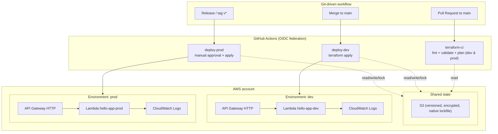
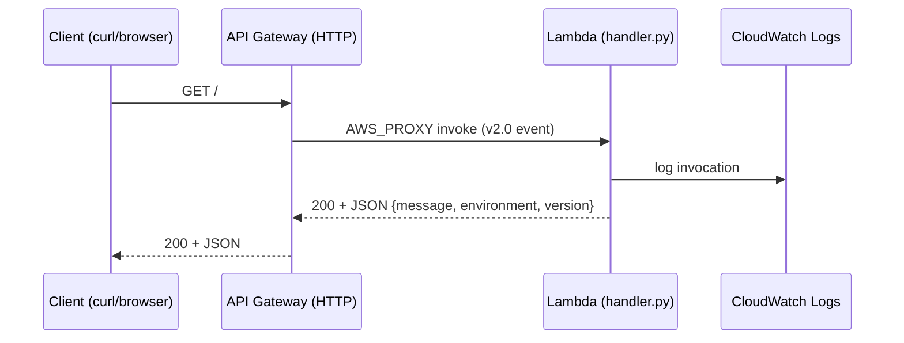

# Solution architecture

## Overview

A serverless "Hello World" application deployed to AWS via Terraform and
GitHub Actions, across two isolated environments.

## Request flow

## Components

- **Application** (`app/src/handler.py`): a Python Lambda returning a JSON
  greeting that includes the environment name and version.
- **Module** (`modules/lambda-api`): packages the source, creates the Lambda,
  its least-privilege IAM role, a CloudWatch log group with retention, and an
  HTTP API Gateway with an `ANY /` route.
- **Environments** (`environments/dev`, `environments/prod`): thin root modules
  that call the shared module with environment-specific inputs and their own
  remote-state key.
- **Bootstrap** (`bootstrap/`): one-time creation of the state bucket and the
  GitHub OIDC provider + IAM role.

## Why this design

- A single reusable module keeps the two environments consistent and DRY; they
  differ only by input values (memory, log retention, version label).
- Remote state in S3 with native lockfile locking (`use_lockfile`, Terraform
  >= 1.10) enables safe concurrent collaboration and CI execution without a
  separate DynamoDB table. Separate state keys guarantee environment isolation.
- OIDC removes the need to store static AWS access keys in GitHub.
