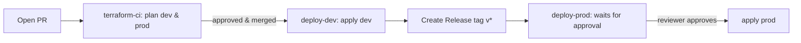

# CI/CD workflow design

Three workflows implement an end-to-end, Git-driven pipeline that deploys both
**infrastructure** and the **application**.

## Triggers and stages

| Workflow | Git trigger | Environment | Action | Gate |
|---|---|---|---|---|
| `terraform-ci.yml`  | Pull request → `main` | dev + prod (matrix) | fmt, validate, plan | none (read-only) |
| `deploy-dev.yml`    | Push/merge → `main`   | dev  | `terraform apply` | GitHub Environment `dev` |
| `deploy-prod.yml`   | Release published (`v*`) or manual dispatch | prod | plan + `terraform apply` | GitHub Environment `prod` with **required reviewers** = manual approval |



## How both infra and app are deployed

Terraform manages the Lambda function code via `archive_file` and
`source_code_hash`. When `app/src` changes, the hash changes, so the next
`terraform apply` updates the running function. This means a single pipeline
covers:

- **Infrastructure changes** (API Gateway, IAM, log config) — normal Terraform diff.
- **Application changes** (handler code) — detected via source hash, redeployed
  by the same apply step.

The deployed `app_version` is injected by CI (`git sha` for dev, release tag for
prod) so each deployment is traceable in the app's response payload.

## Authentication (no static keys)

Workflows request an OIDC token (`permissions: id-token: write`) and exchange it
for short-lived AWS credentials by assuming `AWS_ROLE_ARN`. The role's trust
policy restricts which repository (and can restrict which branch/tag) may assume
it.

## State and locking in CI

Each job runs `terraform init` with partial backend config:

```
terraform init -backend-config=backend.hcl -backend-config="bucket=$TF_STATE_BUCKET"
```

Native S3 state locking (`use_lockfile = true`, Terraform >= 1.10) plus the
`concurrency` group per environment prevent two overlapping applies to the same
state. No DynamoDB table is involved.

## Required GitHub configuration

Secrets: `AWS_ROLE_ARN`, `TF_STATE_BUCKET`.
Environments: `dev` (open), `prod` (required reviewers enabled).
